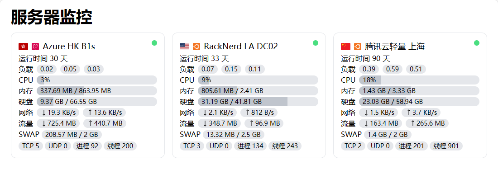

# ServerStatus Theme Light



在线预览: [ssr-theme-light.orilight.top](https://ssr-theme-light.orilight.top/)

## 简介

使用 Vue 与 Tailwind CSS 构建的极简 ServerStatus 主题

基于 [zdz/ServerStatus-Rust](https://github.com/zdz/ServerStatus-Rust) 开发

已兼容的 ServerStatus 实现:

- [zdz/ServerStatus-Rust](https://github.com/zdz/ServerStatus-Rust)
- [cppla/ServerStatus](https://github.com/cppla/ServerStatus)

## 特性

- 卡片式极简主题
- 响应式界面
- 不支持三网 Ping 和丢包数据的显示

## 使用

```shell
# 安装依赖
yarn install

# 打包构建
yarn build
```

打包完成后使用 dist 目录内文件替换原主题即可

具体操作请看 [github.com/zdz/ServerStatus-Rust#6-faq](https://github.com/zdz/ServerStatus-Rust#6-faq) 中的 **如何使用自定义主题**

## 感谢

- [zdz/ServerStatus-Rust](https://github.com/zdz/ServerStatus-Rust)
