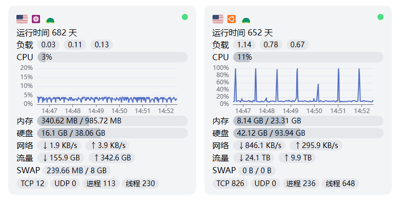
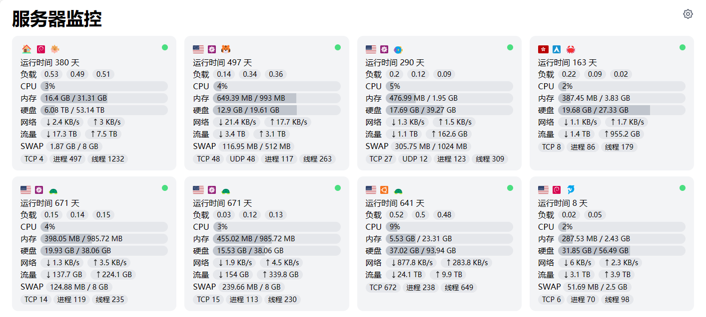
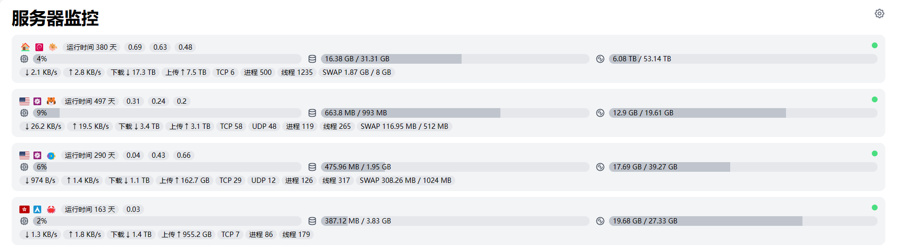

# ServerStatus Theme Light

<details>
<summary>界面截图</summary>

CPU 占用率图表


卡片布局


列表式布局


</details>

在线预览: [sstl-demo.orilight.top](https://sstl-demo.orilight.top/)

## 简介

使用 Vue 与 Tailwind CSS 构建的 ServerStatus 主题

基于 [zdz/ServerStatus-Rust](https://github.com/zdz/ServerStatus-Rust) 开发

已兼容的 ServerStatus 实现（仅使用实例站点数据测试，不保证完全兼容，遇到问题请提 Issue）:

- [zdz/ServerStatus-Rust](https://github.com/zdz/ServerStatus-Rust)
- [cppla/ServerStatus](https://github.com/cppla/ServerStatus)
- [BotoX/ServerStatus](https://github.com/BotoX/ServerStatus)

## 特性

- 卡片式/列表式布局
- 响应式界面
- CPU占用率图表
- 不支持三网 Ping 和丢包数据的显示

## 使用

前往 [Release](https://github.com/orilights/ServerStatus-Theme-Light/releases) 下载 `dist.zip` 解压替换原主题即可

也可自行打包构建:

```shell
# 需要 NodeJS 环境并安装 pnpm 包管理器

# 安装依赖
pnpm i

# 打包构建
pnpm build
```

打包完成后使用 dist 目录内文件替换原主题即可

具体操作请看 [github.com/zdz/ServerStatus-Rust#6-faq](https://github.com/zdz/ServerStatus-Rust#6-faq) 中的 **如何使用自定义主题**

## 感谢

- [zdz/ServerStatus-Rust](https://github.com/zdz/ServerStatus-Rust)
